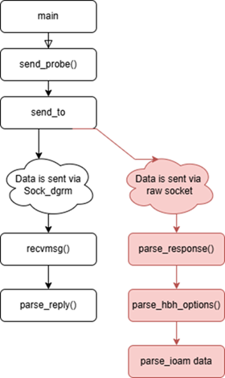
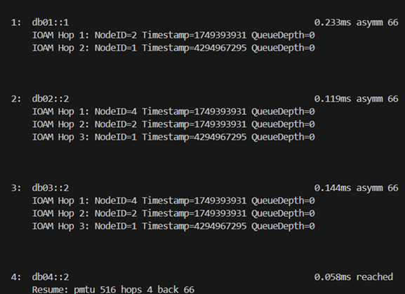

# IOAM Tracepath Emulation — Quick Setup Guide

## 1. Prerequisites

* **Root privileges** (required for namespaces and sysctls)
* **Linux kernel with IOAM6 support** (`CONFIG_IPV6_IOAM6_LWTUNNEL=y`)
* **iproute2** with IOAM support
* **Build tools:** git, meson, ninja

---

## 2. Project Structure

```
IOAM_Project/
├─ build_tracepath.sh        # Builds IOAM-enabled tracepath (meson + ninja)
├─ run_emulation.sh          # Runs network emulation and captures packets
├─ IOAM_net_emulation.sh     # Configures IOAM-enabled IPv6 namespaces
├─ tools/
│  └─ iputils_ioam/          # Cloned iputils repository for tracepath build
│     ├─ tracepath.c         # Custom IOAM-enabled implementation
│     ├─ build/              # Compiled output directory (after build)
│     ├─ meson.build         # Build configuration
│     └─ ...
├─ gamma.pcap                # Example output capture file (generated)
├─ packets.json              # Exported packet data (generated)
├─ filtered_ioam.json        # Processed IOAM data (optional output)
└─ lib.sh / filter.jq        # Helper and filter scripts used by emulation
```

---

## 3. Flow Diagram — IOAM-Enabled tracepath



The modified tracepath sends and receives packets using both datagram (`Sock_dgrm`) and raw socket paths to parse IOAM Hop-by-Hop data.

---

## 4. Example Output — IOAM Trace Results



The IOAM trace shows each hop with Node IDs, timestamps, and queue depth data extracted from IOAM fields.

---

## 5. Quick Start (from IOAM_Project folder)

### Clone and Prepare iputils

```
git clone https://github.com/iputils/iputils.git tools/iputils_ioam
```

This creates the working directory for building tracepath.

### Build tracepath

```
./build_tracepath.sh
```

This script automatically configures and compiles the IOAM-enabled tracepath binary at:

```
tools/iputils_ioam/build/tracepath
```

### Run IOAM Emulation

```
sudo ./run_emulation.sh
```

This will:

* Set up network namespaces and IOAM routes using `IOAM_net_emulation.sh`
* Build and run the custom `tracepath` binary
* Capture packets (`gamma.pcap`) and export them to JSON using `tshark` and `jq`

---

## 6. Run Custom tracepath Manually

After the emulation environment is set up, you can manually run tracepath:

```
sudo ip netns exec alpha ./tools/iputils_ioam/build/tracepath -6 db04::2 -n
```

Everything runs directly from the **IOAM_Project** folder. No need to replace or modify original files.
